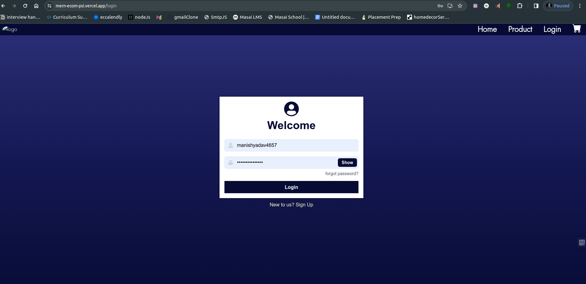
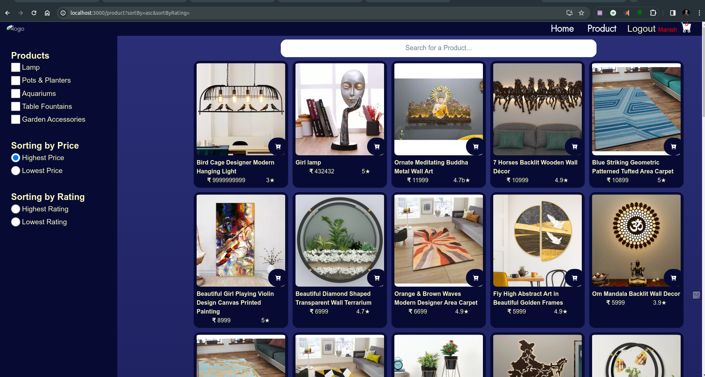
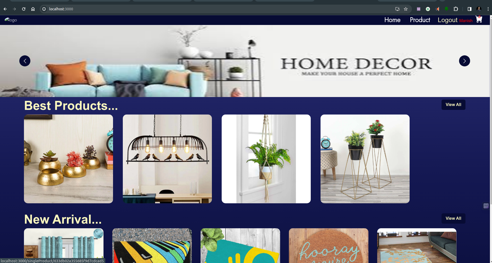
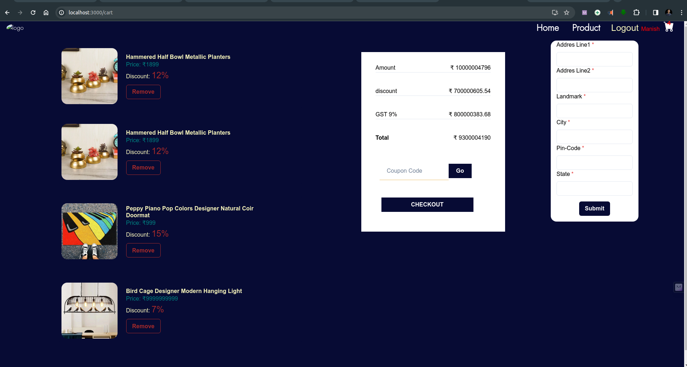

# Admin Dashboard

On Admin dashboard admin can add, edit and delete products of the website. Admin can also see the orders placed by the users. Admin can also see the users registered on the website. 

# Login Page Preview
For login we use Authentication System. and we store all the user data in monogodb and use custom middleware for authentication

# Product Page Preview
On Product cosumer can search for products and filter products accourding to category and sort according to highest price and lowest price and on basis of rating of the product

# Home Page
On Home page consumer is able to see the latest arrivals of the website and banners of sales and discounts.

# Cart Page Preview
On Cart page consumer is able to delete products form the cart and able to see the product details. User can easily checkout the product after filling the address field and then fill the card details

